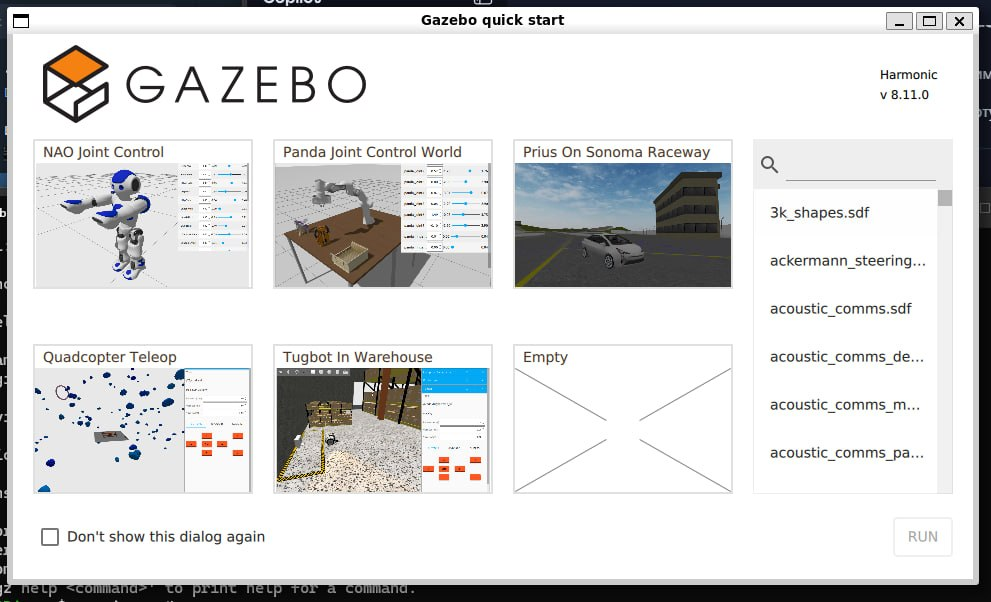
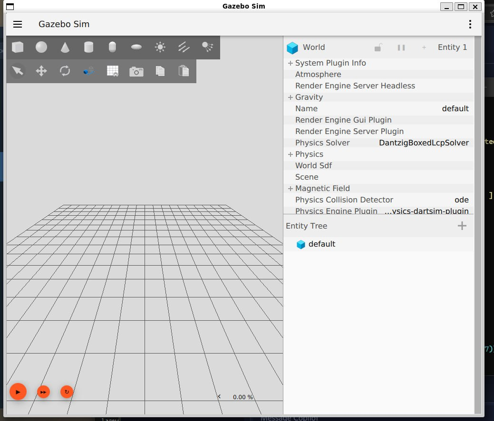
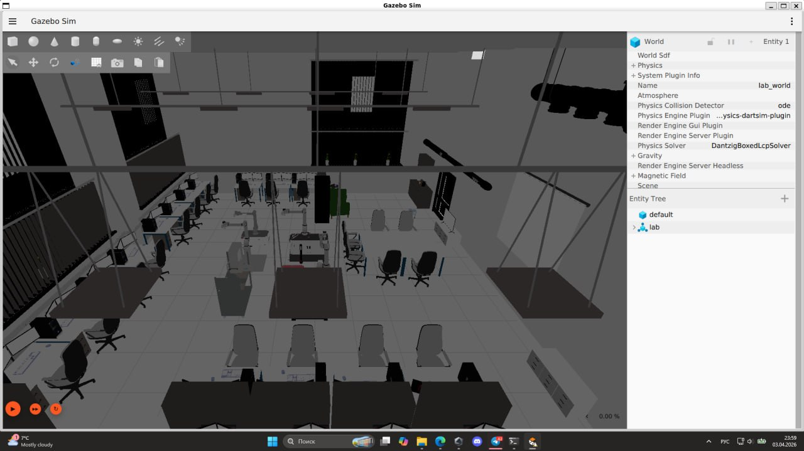
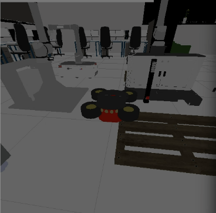

# 🏗️ Virtual Lab Simulator (ROS 2 Jazzy + Gazebo Harmonic)

## 📌 Описание проекта

Данный проект представляет собой **виртуальную симуляцию робототехнической лаборатории**, разработанную с использованием фреймворка **ROS 2 Jazzy** и симулятора **Gazebo Harmonic**.

Основная цель проекта — создание точной цифровой копии лабораторного пространства для тестирования алгоритмов управления мобильными роботами в безопасной и контролируемой среде.

### 🎯 Цели и задачи
*   **Изучение ROS 2**: Отработка навыков работы с современным стандартом робототехники.
*   **Моделирование среды**: Точное воспроизведение размеров и компонентов реальной лаборатории (`lab_world.sdf`).
*   **Интеграция робота**: Интеграция модели **Pioneer3AT**, адаптированной под стандарт **SDFormat 1.7**.
*   **Управление**: Реализация дифференциального привода через плагин `gz::sim::systems::DiffDrive`.

---

## 🚀 Основные возможности

*   ✅ **Высокая совместимость**: Поддержка последних версий ПО (Ubuntu 24.04, ROS 2 Jazzy).
*   ✅ **Реалистичная физика**: Настроенная инерция и коллизии для всех компонентов робота.
*   ✅ **ROS 2 Bridge**: Прямое управление роботом через стандартные топики (`/model/robot/cmd_vel`).
*   ✅ **Готовый Pipeline**: Автоматизированный запуск мира, загрузка робота и готовность к управлению.

---

## 🛠 Требования к окружению

Для корректной работы симулятора необходимо:
*   **ОС**: Ubuntu 22.04 / 24.04
*   **ROS 2**: Jazzy Jalisco
*   **Simulator**: Gazebo Harmonic (gz-sim 8)
*   **Build Tool**: `colcon`

---

## 📦 Установка и настройка

### 1. Подготовка зависимостей
```bash
# Установка Gazebo Harmonic
sudo apt install gz-harmonic

# Установка ROS 2 Jazzy (если не установлен)
sudo apt install ros-jazzy-desktop
```

### 2. Клонирование и сборка
```bash
# Клонирование проекта
git clone <URL_РЕПОЗИТОРИЯ> lab_simulator
cd lab_simulator/sim/ros2_ws

# Сборка рабочего пространства
colcon build
source install/setup.bash
```

### 3. Установка моделей
Для корректного отображения робота необходимо скопировать модель в папку моделей Gazebo:
```bash
mkdir -p ~/.gz/models/pioneer3at
cp -r src/lab_world/models/pioneer3at/* ~/.gz/models/pioneer3at/
```

---

## ▶️ Запуск и управление

### Запуск симуляции
```bash
gz sim src/lab_world/worlds/lab_world.sdf
```

### 🎮 Управление движением
Вы можете отправлять команды движения в топик `/model/robot/cmd_vel`:

**Вперед:**
```bash
ros2 topic pub -r 10 /model/robot/cmd_vel geometry_msgs/msg/Twist "{linear: {x: 0.5}, angular: {z: 0.0}}"
```

**Поворот:**
```bash
ros2 topic pub -r 10 /model/robot/cmd_vel geometry_msgs/msg/Twist "{linear: {x: 0.0}, angular: {z: 1.0}}"
```

---

## 📂 Структура проекта
```text
.
├── sim/
│   ├── ros2_ws/                # Рабочее пространство ROS 2
│   │   └── src/
│   │       └── lab_world/      # Пакет с миром и моделями
│   │           ├── worlds/     # Файлы миров (.sdf)
│   │           └── models/     # 3D модели роботов и окружения
├── Медиаматериалы/             # Скриншоты и видео работы
└── README.md                   # Текущая документация
```

---

## 📸 Галерея

**Начальный экран Gazebo**


**Пустой интерфейс**


**Вид лаборатории**


**Робот**



---

## 🔗 Полезные ссылки
- 📚 [Обучающий материал](https://drive.google.com/drive/folders/1sOKft4HpGRqkV8_gu-UKbJ_cVVKkMLHk)
- 💾 [Ссылка на исходные файлы проекта](https://drive.google.com/drive/folders/1Y_KznlnYvyd5uYeRSHMDFU8NzosCDAZX?usp=sharing)
- 🎥 [Видео работы симулятора](Медиаматериалы/Work_project.mp4)
